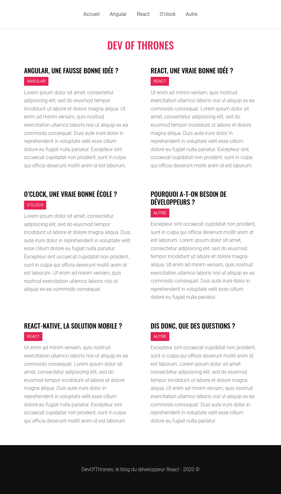

# Blog React

## Charte graphique

- Le fichier de variables scss est déjà préparé dans `src/styles/_vars.scss` :+1:
- le fichier index.html contient déjà les appels aux fonts

### Google Fonts

- Roboto `300` : textes et contenus
- Oswald `500` : titres

### Couleurs

- Header
  - Bordure : `#ddd`
  - Liens : `#101010`
  - Liens hover : `#e52354`
- Posts
  - Titre principal : `#e52354`
  - Post unique 
    - Titre : `#000`
    - Background au hover : `#f7f7f7`
    - Category
      - Arrière plan : `#e52354`
      - Couleur : `#fff`
    - Content : `#777`
- Footer
  - Arrière plan : `#101010`
  - Couleur : `#ddd`

